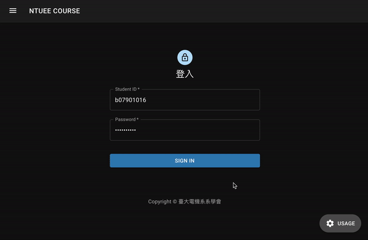

# NTUEECourse2020

2020 年新版臺大電機系預選網站 (https://course.ntuee.org/)

## Usage

<div align="center">

</div>

## Contributors

前端：[朱哲廣](https://github.com/Kenchu123),
email: `b07901016@ntu.edu.tw`

後端：[劉奇聖](https://github.com/MortalHappiness), email: `b07901069@ntu.edu.tw`

## Quick Start (Development mode)

After cloning this repo, put `students.json` into `./server/database/private-data/`, and then execute the following commands.

For the format and generation of `students.json`, see [password generation](#gen_password).

```shell
$ npm install
$ sudo docker-compose up -d    # This will watch backend code changes
$ npm run develop-client       # This will open webpack-dev-server for frontend
```

Goto `http://localhost:8000` to see the website.

## Development

Type the following command to go into docker container.

```shell
$ sudo docker-compose exec course2020 bash
```

And then you can use `/app/server/database/database.js` to control database.

Type `node database.js --help` for help.

## Directory Structure

    .
    ├── assets/                    - static assets
    ├── client/                    - frontend code
        ├── html                   - html template
        └── src                    - js source code
            ├── actions            - Redux actions
            ├── components         - React components
            ├── constants          - actionTypes and initial state
            ├── reducers           - Redux reducers
            ├── routes             - React router
            ├── store              - Redux store
            └── theme              - color theme
    ├── server/                    - backend code
        ├── routes/                - express routers
        └── database               - database-related codes
            ├── data/              - Non-secret data, e.g. course names
            ├── private-data/      - Secret data, e.g. student names and passwords
            ├── mongo/             - MongoDB-related codes
            ├── redis/             - RedisDB-related codes
            ├── database.js        - CLI for database operations
            └── gen_password.py    - Script for generating student passwords
    ├── Dockerfile                 - For deploy
    └── docker-compose.yml         - For development

## 預選 SOP

<h3 id="gen_password">1. Password generation</h3>

1. 跟學術部拿學生名單(students.csv),放到`./server/database/private-data/`裡 格式如下：
   ```
   id,grade,name
   B07901XXX,3,劉奇聖
   B07901XXX,3,朱哲廣
   ...
   ```
   註：id 是學號，grade 是年級，name 是姓名
2. 進到`./server/database/private-data/`，跑
   ```shell
   python gen_password.py
   ```
   會生成兩個檔案`students.json`和`students_password.csv`在`private-data/`裡。
3. 把`students_password.csv`給學術部
4. `students.json`的格式如下：
   ```
   [
     {
       "userID": "B07901XXX",
       "grade": 3,
       "password": "abcdefg"
     },
     ...
   ]
   ```

### 2. Prepare data

準備好`./server/database/data/`資料夾裡的資料，格式請自己看[repo 上的檔案](/server/database/data)。

### 3. Reset database

去系學會伺服器的`/home/ntuee/production`資料夾下跑

```
docker-compose exec course2020-admin npm run reset-db
```

### 4. Export data

預選結束之後，去系學會伺服器的`/home/ntuee/production`資料夾下跑

```
docker-compose exec course2020-admin bash
cd server/database
node database.js export
```

然後把系學會伺服器的`/home/ntuee/production/NTUEECourseWebsite2020/database/private-data/selections.json`拿去跑[分發程式](https://github.com/NTUEEInfoDep/NTUEECourseDistribute2020)。

## Backend Api

```
課程種類： "0"(實驗), "1"(大一必修), "2"(大二必修), "3"(大三必修)
```

註：沒在開放日期內 request api 都會發 503 status code, 且 response body 會給開放日期，格式如下 (value 為 ISOString):

```
{
  "start": "2020-07-19T16:00:00.000Z",
  "end": "2020-07-21T19:00:00.000Z"
}
```

<table>
  <tr>
    <th>Method</th>
    <th>Route</th>
    <th>Request Body</th>
    <th>Response</th>
    <th>Description</th>
  </tr>

  <tr>
    <td>GET</td>
    <td>/api/session</td>
    <td></td>
    <td>
      Success: 200<br />
      JSON Response:<br />
<pre>
{
  userID: 學號(String)
}
</pre>
      Failed:<br />
      403: 沒登入
    </td>
    <td>Get user session data</td>
  </tr>

  <tr>
    <td>POST</td>
    <td>/api/session</td>
    <td>
      type: <code>x-www-form-urlencoded</code><br />
      content:
      <table>
        <tr>
          <th>KEY</th>
          <th>VALUE</th>
        </tr>
        <tr>
          <td>userID</td>
          <td>學號(String)</td>
        </tr>
        <tr>
          <td>password</td>
          <td>密碼(String)</td>
        </tr>
      </table>
    </td>
    <td>
        Success: 201<br />
        JSON Response:<br />
<pre>
{
  userID: 學號(String)
}
</pre>
      Failed:<br />
      400: Request body格式錯誤<br />
      401: 密碼錯誤
    </td>
    <td>Login</td>
  </tr>

  <tr>
    <td>DELETE</td>
    <td>/api/session</td>
    <td></td>
    <td>
      Success: 204
    </td>
    <td>Logout</td>
  </tr>

  <tr>
    <td>GET</td>
    <td>/api/courses</td>
    <td></td>
    <td>
      Success: 200<br />
<pre>
{
  type(String, 課程種類)：[
    {
      courseID: 課程 ID(String),
      name: 課程名稱(String),
    },
    ...
  ],
  ...
}
</pre>
      Failed:<br />
      403: 沒登入
    </td>
    <td>Get all courses</td>
  </tr>

  <tr>
    <td>GET</td>
    <td>/api/selections/:courseID</td>
    <td></td>
    <td>
      Success: 200<br />
      JSON Response:<br />
<pre>
{
  name: 課程名稱(String),
  type: 課程種類,
  description: 課程描述(String),
  selected(String, 選的選項照志願序順序): [選項名稱(String), ...],
  unselected(String, 沒選的選項無排序): [選項名稱(String), ...],
}
</pre>
      Failed:<br />
      403: 沒登入<br />
      404: 不合法的courseID
    </td>
    <td>Get course selection</td>
  </tr>

  <tr>
    <td>PUT</td>
    <td>/api/selections/:courseID</td>
    <td>
      type: <code>json</code><br />
      content:<br />
<pre>
(一條Array裡面都是選項名稱，照志願序排序)
[選項名稱(String)]
</pre>
    </td>
    <td>
      Success: 204<br />
      Failed:<br />
      403: 沒登入<br />
      404: 不合法的courseID<br />
      400: Request body 格式錯誤
    </td>
    <td>Update course selection</td>
  </tr>

</table>
